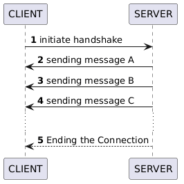

<div align="center">

# SSE GUIDE

**Dead simply guide how is SSE works**

[🇬🇧 English](README.md) • [🇷🇺 Russian](docs/README_RU.md)

Сделано с ❤️ от [@Slipynil](https://github.com/slipynil)

My channel 
<a href="https:/t.me/G0ndonClub">
  
</a>
</div>

## Что такое *SSE*?
***SSE (Server Send Event)*** - это технология позволяющая серверу отправлять данные клиенту в одностороннем режиме. В классическом протоколе HTTP сервер не может сам инициировать передачу данных, так как он только отвечает на входящие запросы. *SSE* решает эту проблему позволяя серверу пушить сообщения по открытому соединению.

## Зачем использовать *SSE*?
*SSE* оптимален, когда требуется одностороняя передача данных от сервера к клиенту в реальном времени, а встречный поток сообщений от клиента в задаче не нужен.

## Когда следует использовать *SSE*?
Выбирайте *SSE*, если вам нужна простая односторонняя связь (например, для ленты уведомлений, курсов валют или прогресс-баров). Если же приложению необходим полноценный двусторонний обмен данными в реальном времени (чат, онлайн-игра), то лучше использовать *WebSocket*.

## Как работает система *SSE*?
Поскольку сервер не может начать передачу первым, соединение всегда **инициализирует клиент** (**1**). Он отправляет специальный HTTP-запрос, в котором сообщает, что готов принимать поток событий (*Event Stream*). Сервер не закрывает соединение после первого ответа, а оставляет его открытым, "удерживая" канал для передачи будущих сообщений. 

## Что это значит?
Вместо того, чтобы отправить данные и разорвать связь, сервер переводит HTTP-соединение в режим **потоковой передачи**. В рамках этого "вечного" соединения сервер может в любой момент отправить клиенту новое сообщение (**2, 3, 4**) без необходимости получать новый запрос.
Фактически клиент находится в состоянии ожидания продолжения ответа. Это продолжается до тех пор, пока сервер сам не решит завершить сессию или пока не произойдет разрыв связи со стороны клиента (**5**). При случайном обрыве клиент, как правило, автоматически пытается переподключиться.
<div align="center">

</div>
## Как разорвать соединение?
Сервер может закрыть соединение в любой момент, просто завершив передачу потока данных. Со своей стороны клиент также может легко прервать связь, отменив активный HTTP-запрос. Как только клиент разрывает соединение, сервер получает уведомление об этом и освобождает ресурсы, выделенные под этот канал.

## Почему не использовать WebSocket во всех случаях?
Хотя WebSocket обеспечивает полноценную двустороннюю связь, у SSE есть свои преимущества:

* Простота реализации: SSE работает поверх обычного протокола HTTP и не требует настройки специальных прокси-серверов или сложных протоколов.
* Экономия ресурсов (RPS): Для простых уведомлений SSE потребляет меньше ресурсов сервера, так как работает в рамках стандартного стека HTTP.
* Автоматическое переподключение: В стандарт SSE встроена поддержка восстановления связи при обрыве — браузер сделает это сам, без написания лишнего кода.
* Легкость отладки: Поток сообщений SSE — это обычный текст, который легко просматривать в консоли разработчика браузера.

Итог: Если вам не нужно отправлять данные от клиента серверу каждые 100 мс (как в играх), SSE будет более легким и надежным решением.

# Как реализовать *SSE*-сервер на Go?
**Это упрощенный пример для одного активного соединения**

## Архитектура системы
В данной реализации используются два эндпоинта:
* **`/handshake`** - эндпоинт для установки SSE-соединения. Клиент подключается к нему и получает открытый поток событий.
* **`/sendmessage`** - эндпоинт для триггера отправки сообщений. Внешний запрос на этот эндпоинт помещает сообщение в канал `messageChan`, откуда оно передается активному клиенту.

Глобальный канал `messageChan` служит связующим звеном между эндпоинтом отправки и активным SSE-соединением.

⚠️ **Важные ограничения:**
* Глобальный канал пересоздается при каждом новом подключении
* При множественных одновременных подключениях возможны race conditions
* Для production-окружения необходима карта каналов с мьютексами для поддержки нескольких клиентов

Мы будем использовать встроенную библиотеку ***net/http*** для работы с *HTTP*. Можно использовать другие библиотеки, такие как *gin* или *echo*.
```go
func (w http.ResponseWriter, r *http.Request)
```
Создайте канал с именем `messageChan`. Сообщение клиенту будет доставлено через него. Переменная канала должна быть определена где-нибудь, где мы сможем к ней получить доступ. Допустим, сейчас мы просто отправляем строковое сообщение.
```go
messageChan = make(chan string)
```
Для части кода, отвечающей за "*trap-request*", мы будем использовать бесконечный цикл. Внутри этого цикла процесс будет заблокирован каналом `messageChan`. Канал `messageChan` продолжает ждать и прослушивать готовность сообщения. Если сообщение доступно, оно будет отправлено в HTTP-записывающее устройство. Нам также необходимо отправить сообщение в кэш, чтобы клиент мог его увидеть. В случае получения сигнала о закрытии соединения от клиента, функция `r.Context().Done()` выдаст сигнал "*close*", и мы сможем выйти из цикла (фактически, мы выходим их функции, а не просто из цикла). Здесь мы поддерживаем соединение.
```go
rc := http.NewResponseController(w)

for {
	select {
		// message send handler
		case message := <- messageChan:
			fmt.Fprintf(w, "data: %s\n\n", message)
			rc.Flush()
		// signal close handler
		case <-r.Context().Done():
			return
	}
}
```
Непосредственно перед выходом их функции необходимо закрыть канал, чтобы избежать утечки памяти. Это можно сделать через `defer`.
```go
defer func() {
	close(messageChan)
	messageChan = nil
}()
```
## Как начать отправку сообщения клиенту?
Мы можем просто поместить сообщение в канал. Убедитесь, что канал `messageChan` был создан до этого.
```go
messageChan <- "Hello world!"
```

# Как реализовать SSE-клиент на Go?

## 1. Инициализация клиента и запроса
Сначала мы инициализируем HTTP-клиент и подготавливаем GET-запрос к эндпоинту сервера.
```go
client := new(http.Client)
req, _ := http.NewRequest("GET", "http://localhost:3000/handshake", nil)
```
### 2. Цикл установки соединения (Reconnect)
Чтобы клиент был отказоустойчивым, мы используем бесконечный цикл. Если сервер недоступен или соединение обрывается, клиент делает паузу и пытается подключиться снова.
```go
for {
	res, err := client.Do(req)
	if err != nil {
		log.Println("Ошибка подключения, повтор через 1 сек...")
		time.Sleep(time.Second)
		continue
	}
	log.Println("Соединение установлено..")
	
	// переходим к чтению потока
	scanner := bufio.NewScanner(res.Body)
}
```

### 3. Чтение потоковых данных (Stream Processing)
*SSE* передает данные посточно. Самый эффективный способ читать такой поток в Go - использовать `bufio.NewScanner`. Он автоматически блокирует выполнение и ждет новую строку от сервера.
```go
scanner := bufio.NewScanner(res.Body)
for scanner.Scan() {
	// Каждая новая строка от сервера попадает сюда
	line := scanner.Text()
	messages <- line
}
```
### 4. Обработка завершаения потока
Цикл `scanner.Scan()` завершиться сам, если:
1. Сервер штатно закрыл соединение.
2. Произошла ошибка сети (её можно проверить через `scanner.Err()`).
После выхода из внутреннего цикла чтения сработает `defer res.Body.Close()`, и внешний цикл `for` отправит клиента на новую попытку переподключения.

### 5. Обёртка в канал
Чтобы удобно использовать полученные данные в других частях программы, мы оборачиваем всю логику в горутину, которая возвращает канал только для чтения:
```go
func reqSSE(client *http.Client) <-chan string {
    messages := make(chan string)
    go func() {
        defer close(messages)

        // Внешний цикл для реконнекта
        for {
            req, err := http.NewRequest("GET", url, nil)
            if err != nil {
                log.Println("ошибка при создании запроса:", err)
                time.Sleep(time.Second)
                continue
            }

            res, err := client.Do(req)
            if err != nil {
                log.Println("ошибка подключения:", err)
                time.Sleep(time.Second)
                continue
            }

            // Внутренний цикл для чтения потока
            scanner := bufio.NewScanner(res.Body)
            for scanner.Scan() {
                line := scanner.Text()
                messages <- line
            }

            res.Body.Close()
            time.Sleep(time.Second) // пауза перед реконнектом
        }
    }()
    return messages
}
```

Использование в main:
```go
func main() {
    client := new(http.Client)
    for msg := range reqSSE(client) {
        log.Println("recv:", msg)
    }
}
```

# Как протестировать систему?

Для проверки работы SSE выполните следующие шаги:

### Шаг 1: Запустите сервер
```bash
go run server/main.go
```
Вы увидите сообщение о том, что сервер запущен на `localhost:3000`.

### Шаг 2: Запустите клиент
В другом терминале выполните:
```bash
go run client/main.go
```
Клиент установит соединение с сервером и будет ожидать сообщений.

### Шаг 3: Отправьте сообщение
В третьем терминале выполните:
```bash
curl localhost:3000/sendmessage
```
Клиент должен получить и вывести сообщение "Привет мир!".

### Ожидаемый результат
В терминале клиента вы увидите:
```
recv: data: Привет мир!
recv:
```

### Почему клиент выводит две строки?

Это связано с форматом протокола SSE и тем, как клиент читает поток данных:

1. **Сервер отправляет** (server/main.go:53):
   ```go
   fmt.Fprintf(w, "data: %s\n\n", message)
   ```
   Формат SSE требует двойного переноса строки `\n\n` после каждого события. Это означает, что сервер отправляет:
   ```
   data: Привет мир!\n\n
   ```

2. **Клиент читает построчно** (client/main.go:43-46):
   ```go
   scanner := bufio.NewScanner(res.Body)
   for scanner.Scan() {
       line := scanner.Text()
       messages <- line
   }
   ```
   `bufio.Scanner` по умолчанию разбивает поток по символам новой строки `\n`. Поэтому он читает:
   - **Первая строка**: `data: Привет мир!` (до первого `\n`)
   - **Вторая строка**: пустая строка `""` (между двумя `\n`)

3. **Вывод в консоль**:
   ```go
   log.Println("recv:", msg)
   ```
   Выводит обе прочитанные строки:
   - `recv: data: Привет мир!` (первое сообщение)
   - `recv:` (второе сообщение — пустая строка)

**Итог**: Двойной перенос строки `\n\n` — это стандарт SSE для разделения событий. Клиент, читая построчно, интерпретирует это как две отдельные строки: одну с данными и одну пустую.

Вы можете отправлять сообщения многократно, выполняя команду `curl` повторно.
